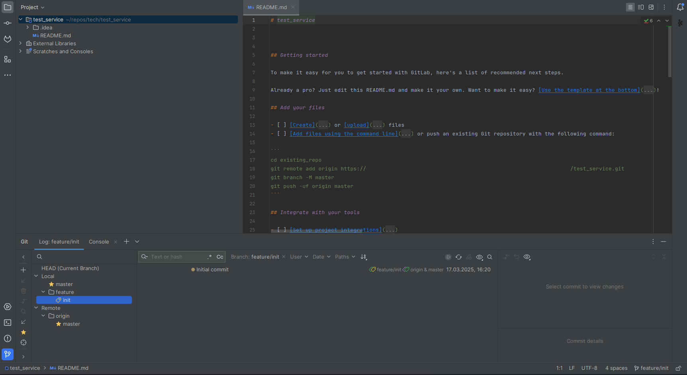

<div align="center">


# Архетип Origami Framework


[](https://www.apache.org/licenses/LICENSE-2.0)
[](https://t.me/origamiframework)

</div>

## Инициализация репозитория

Создаем репозиторий(например, на github), клонируем проект на локальную машину(git clone), создаем необходимую ветку



## Создание нового проекта из архетипа через консоль

В консоли IDE или в консоли ubuntu переходим на уровень выше того каталога, где был инициализирован репозиторий 
и выполняем команду **maven**:

```
mvn -U archetype:generate \
    -DinteractiveMode=false \
    -DarchetypeGroupId=ru.origamiframework \
    -DarchetypeArtifactId=origami-archetype \
    -DarchetypeVersion=1.0.5 \
    -DgroupId={GROUP_ID} -DartifactId={ARTIFACT_ID}
```

## Дальнейшие действия

В resources/origami.properties необходимо указать актуальные значения для свойств testit(при необходимости).

В pom.xml изменить описание проекта на актуальное.

Коммитим и пушим сформировавшиеся файлы.


## Ошибки

При возникновении ошибки

```
    [ERROR] Caused by: Exception com.google.inject.internal.cglib.core.$CodeGenerationException: 
    java.lang.reflect.InaccessibleObjectException-->Unable to make protected final 
    java.lang.Class java.lang.ClassLoader.defineClass(java.lang.String,byte[],int,int,java.security.ProtectionDomain) 
    throws java.lang.ClassFormatError accessible: module java.base does not "opens java.lang" 
    to unnamed module @49c43f4e [in thread "main"]
```

Необходимо проверить **/home/{YOUR_PROFILE}/.bashrc** (на примере ubuntu)

Внутри должна быть строчка

```
    export MAVEN_OPTS="-Djavax.net.ssl.trustStore=/usr/lib/jvm/bellsoft-java8-full-amd64/jre/lib/security/cacerts -Djavax.net.ssl.trustStorePassword=changeit --add-opens java.base/java.lang=ALL-UNNAMED"
```
